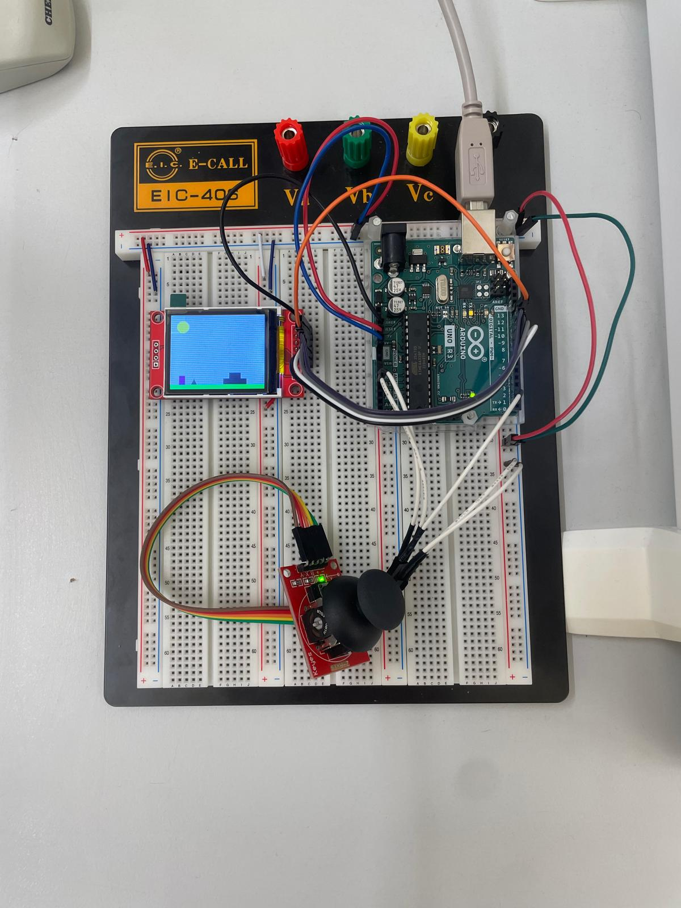

# 2D Jump 'n' Run Spiel von Nicolas Aßmann & Marlene Winter

## Beschreibung

Ein 2D Jump 'n' Run Spiel, angelehnt an Mario, dass mit einem Arduino gespielt werden kann.
Dargestellt wird es mit einem TFT-Display und die Spielereingaben erfolgen über
einen Joystick.





## Spielablauf

Das Spiel beginnt automatisch beim Hochladen oder Starten des Mikrocontrollers und besteht
aus 6 Levels. Ziel ist es, sich stets weiter nach rechts zu bewegen und die Hindernisse zu überwinden. Sobald das letzte 
Level erreicht ist, erscheint ein "You won"-Bildschirm und das Spiel startet von neuem. Wenn der Spieler durch den Boden
fällt, verliert er ein Leben. Nach 9 verlorenen Leben erscheint ein "Game over"-Bildschirm. Der Spieler kann mit dem Joystick
nach rechts und links bewegt werden. Beim Hochdrücken des Joysticks springt der Spieler.

## Hardware

- Arduino Uno Rev 3
- 128 x 160 1,8 Zoll SPI TFT Display
- Joystick

## Einrichtung der Hardware

### Display

Das Display verwendet die SPI-Schnittstellte. SPI ist ein synchrones serielles Kommunikationsprotokoll, das 
 für kurze Entfernungen und hohe Datenraten verwendet wird.

SPI verwendet folgende Leitungen:
- MISO (Master In Slave Out): Wird nicht immer für Displays benötigt.
- MOSI (Master Out Slave In): Überträgt Daten vom Arduino zum Display.
- SCK (Serial Clock): Taktleitung, die vom Master generiert wird, um 
die Synchronisierung der Datenübertragung sicherzustellen.
- SS (Slave Select) oder CS (Chip Select): Wählt das Gerät aus, mit dem der Master kommunizieren möchte.

#### Anschlüsse

In der Main Datei sind die Anschlüsse wie folgt definiert:

```
#define cs 10 // Chip Select
#define dc 9 // Data/Command
#define rst 8 // Reset
```

Zusätzlich werden die Standard-SPI-Pins des Arduino verwendet:

- MOSI (Pin 11)
- SCK (Pin 13)

#### Pin-Verbindungen

| TFT Display Pin   | Arduino Uno Pin |
|-------------------|------------------|
| CS (Chip Select)  | 10               |
| DC (Data/Command) | 9                |
| RST (Reset)       | 8                |
| MOSI (Data In)    | 11               |
| SCK (Clock)       | 13               |
| VCC (Power)       | 5V               |
| GND (Ground)      | GND              |

#### Code zur Initialisierung des Displays

```
// include TFT and SPI libraries
#include <TFT.h>
#include <SPI.h>

// create an instance of the library
TFT TFTscreen = TFT(cs, dc, rst);

void setup() {
  // initialize the library
  TFTscreen.begin();
 }

```

### Joystick

#### Anschlüsse

Der Joystick hat fünf Anschlüsse:

VCC: Stromversorgung (typischerweise 5V)
GND: Masse
VRx: Analogausgang für die horizontale Bewegung (X-Achse)
VRy: Analogausgang für die vertikale Bewegung (Y-Achse)
SW: Digitalausgang für den Taster (integrierter Button im Joystick)

| Joystick Pin | Arduino Pin |
|--------------|-------------|
| VCC          | 5V          |
| GND          | GND         |
| VRx (X-Achse) | A0          |
| VRy (Y-Achse) | A1          |
| SW (Taster)  | 2           |

#### Funktion der Schnittstelle

##### Analogausgänge (VRx und VRy)
VRx und VRy sind analoge Ausgänge, die die Position des Joysticks entlang der X- und Y-Achse messen.
Diese Ausgänge werden an die analogen Eingänge des Arduino (A0 und A1) angeschlossen.
Der Joystick liefert einen Spannungswert zwischen 0 und 5V, abhängig von seiner Position:
In der Mittelstellung liegt die Spannung typischerweise bei etwa 2.5V (512 bei 10-bit ADC).
Wenn der Joystick vollständig in eine Richtung bewegt wird, liegt die Spannung bei 0V oder 5V (0 oder 1023 bei 10-bit ADC).


Im Code werden diese Werte mit `analogRead(pin)` gelesen. Um ungewollten Input zu vermeiden, gibt es im Code einen 
Schwellwert, der überschritten werden muss. 


Codeausschnitt:
```
int calculateSpeedX() {
  int joystickX = analogRead(X_pin);
  if (joystickX < 512 + TRESHOLD && joystickX > 512 - TRESHOLD) return 0;
  int speed = map(joystickX, 0, 1023, -MAX_SPEED, MAX_SPEED);
  return speed;
}

int checkJumping() {
  int joystickY = analogRead(Y_pin);
  if (joystickY < 512 + TRESHOLD) return 0;
  return 1;
}
```


